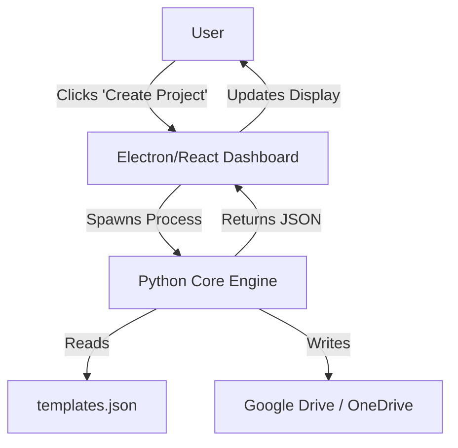

# This markdown file is the transcipt to the conversation between my internal Product Stategy Team an myself(Managing Principle) of the Market Analyst expert that i sent the product too to review.  This document is intended to help assist the Engineering and product team in understanding the goals and intentions of the product.  This will help guide them how to adapt or adjust this build in github to meet this "Roadmap" for our product.

Conversation messages / responses are seperated by """x""".  

"""
Example
"""

Exact use case below

- From me to Product Strategy Team
"""
I asked for a review of the product and gave the history on how this came to life to a market analyst.  Review this for a conversation.  Its a long read and I haven't read it yet.

"Your role is a Master Marketer, Product analyzer, and senior product salesmen.  Please review the attached and the githubs that you are connected to.  I also supplied links.   
Please give me your opinion on where we are heading and where we stand.  I do not need a yes man.  I need someone whos going to be honest and critical.

I was in the middle of working on a "standard" file structure for my own company i own, xsvStudio, LLC, [https://www.xsvstudio.com](https://www.xsvstudio.com), when in the process i was implementing some workflows automation and lessons learned on file structure and more from my career working with hundreds and hundreds of companies, clients, sub-contractors etc.  

During this process, i felt like what i was working on could assist HUNDREDS of companies and people.  So I saw a potential for a "product" out of a solution that i am building for my company.  Now i dont know if i am right or wrong but i feel its got some potential.  If not thats OK cause it will work for the goals of my company.  Please review the attached for a history how this grew, and the github.  


Main Repo
[https://github.com/xsvStudio/root-architecture](https://github.com/xsvStudio/root-architecture)
Feature GUI
[https://github.com/xsvStudio/root-architecture/tree/feature/gui-installer](https://github.com/xsvStudio/root-architecture/tree/feature/gui-installer)

Now let me prepare the comprehensive final report:

# xsvStudio: Strategic Assessment of Your Operational Architecture Product

## Executive Summary

You've built something valuable—but it's stuck in the "Productized Service" zone, and you need to make a hard decision about what it actually is. The codebase is production-grade, the thinking is sophisticated, and the operational model is sound. However, the product lacks clear market positioning, and the go-to-market narrative is muddled between three conflicting stories: (1) internal tool for your company, (2) white-label framework for agencies, and (3) enterprise SaaS. You cannot execute all three simultaneously.

**The opportunity is real.** The global project management software market will reach $27 billion by 2032 (growing at 15.6% annually), and the adjacent "workflow standardization" space is even larger and more fragmented. However, you're entering a market crowded with entrenched competitors (Monday.com, Asana, Linear, Notion) who have raised hundreds of millions. You cannot win by being generic. You will only win by being specific—ruthlessly specific about one customer type, one pain point, and one implementation path.[1][2]

**Your current positioning is too broad.** The root-architecture framework attempts to serve web development, IT services, construction management, manufacturing, and legal services simultaneously. This violates the first law of product strategy: **MECE positioning.** You need to pick one vertical, own it completely, and then expand horizontally from a position of strength.

***

## Part 1: What You've Built Correctly

### 1. Technical Architecture is Sound

The GitHub repository structure is excellent. You've implemented:[3]

- **Configuration-driven behavior**: The audit toggle system (PR #1) decouples policy from code—operations teams can modify behavior without developer involvement.[3]
- **Idempotent operations**: The project initialization scripts use safe defaults and dry-run modes, critical for enterprises.
- **Versioned standards**: Pull request standards, audit configurations, and lessons-learned documentation are all version-controlled—no Slack memo chaos.[3]
- **GitHub Actions automation**: CI/CD pipelines enforce quality gates before merge, which is table-stakes for professional software.

The code maturity is what separates this from "just a GitHub template." Most open-source project management repos are static scaffolds. Yours is dynamic and self-governing.

### 2. Operational Thinking is Mature

Your "Owner's Representative" standard—borrowed from construction where you actually stamp permits—is psychologically powerful. It reframes folder structure from "nice to have" to "legal and financial liability." This is sophisticated positioning that most software vendors miss.[4]

The Flash-Log protocol (interrupt capture without context-switching) addresses a real problem that most teams experience: good ideas disappearing into chat logs or email threads. The GUI implementation with a dedicated tab for this is a clever UX choice—you're not adding friction, you're removing it.[5]

The client-centric folder structure (organize by client first, then by service type) is correct for multi-service agencies. It prevents the fragmentation nightmare where project documents live in five different places.

### 3. Realistic Understanding of Team Dynamics

Your comments about employees not finding files, templates getting corrupted by unauthorized edits, and the gap between "perfect systems" and "human reality" show you understand organizational dysfunction. This grounded perspective is what separates people who ship products from people who ship theory.[3]

***

## Part 2: Critical Problems with Current Positioning

### 1. Market Positioning is Incoherent

Reading your documentation, I cannot determine who your customer is. Consider these three conflicting narratives:

**Narrative A: Internal Tool**
> "I was in the middle of working on a 'standard' file structure for my own company...during this process I felt like what I was working on could assist HUNDREDS of companies."

This reads as a founder using their own company as a laboratory and asking, "Is this a product?"

**Narrative B: Productized Service**
> "The Project build controlled in GitHub. But we should maintain this build's information in our companies Google Drive as a normal client to our company right?"

This treats the system as a service you deliver to clients, not a software product they self-serve.

**Narrative C: Enterprise SaaS**
> "Free vs pro tier with license key mechanism...custom naming rules...multi-service support..."

This reads like enterprise SaaS positioning.

These are mutually exclusive go-to-market strategies, each requiring different:
- Pricing models
- Sales processes
- Deployment architectures
- Customer support
- Feature prioritization

**The risk:** You build features for Narrative C (API, multi-tenant deployment, SSO), but market it as Narrative A (GitHub repo download), and end up with neither a viable product nor a viable service.

### 2. Target Customer is Undefined

Your documentation mentions serving five service types: WEB, IT, CM, MFG, LEGAL. Each has radically different needs:

| Service | Primary Pain | Folder Logic | Audit Need | Compliance Driver |
|---------|-------------|--------------|------------|------------------|
| **WEB** | Code version control | GitHub → Drive mirror | Style consistency | Portfolio showcase |
| **IT** | Infrastructure chaos | Config → Documentation | Security audits | Regulatory (SOC2/ISO) |
| **CM** | RFI/Change order tracking | Chronological + Status | Liability mitigation | Contract law |
| **MFG** | Equipment/process docs | Equipment ID first | FDA/GMP if applicable | Industry standard |
| **LEGAL** | Discovery, redaction | Attorney privilege structure | Evidence integrity | Bar association rules |

A construction manager's folder structure should NOT look like a web developer's. Yet your product treats them as variants of the same thing with different "service codes." This is generic thinking in a vertical-specific market.

**The verdict:** You're trying to build a "general-purpose operating system" when the market demands "best-in-class verticalized solutions." Nobody buys an OS; they buy tools that solve their specific problem.[3]

### 3. Monetization Model is Vague

The free/pro tier with license key is clever for distribution, but I see no articulation of:

- **What differentiates free vs pro?** (Unlimited projects? Advanced audit? Custom naming?)
- **What does a customer pay?** ($50/month? $500/month? One-time?)
- **Who decides to buy?** (Ops manager? CTO? Finance?)
- **What's the customer payback period?** (Time saved per month? Error reduction?)

Most SaaS pricing anchors to one of these: per user, per project, per GB stored, or per audit run. You haven't picked one.

### 4. Competitive Landscape is Underestimated

You're not actually competing with other folder structure tools (there aren't many). You're competing for budget against:

- **Asana + Google Drive templates**: Already purchased, already used.
- **Monday.com with custom fields**: Expensive but familiar to buyers.
- **Notion + Zapier automation**: Cheap, flexible, but requires manual setup.
- **Salesforce + Workbrain**: Enterprise standard, but locked into ecosystem.
- **DIY GitHub + scripts**: Free, but requires dev resources.

Your product must offer something these don't. The candidates are:

1. **Vertical integration**: "We do folder structure + audit + compliance + reporting for [CM/IT/MFG only]"
2. **AI/automation**: "We auto-generate folder structure based on your project specs and historical patterns"
3. **Governance**: "We enforce your standards, audit violations, and generate compliance reports"
4. **Integration**: "We connect your folder structure to your accounting, CRM, and project tracker"

You've mentioned governance in docs, but you haven't led with it in positioning. That's a mistake.

### 5. Scaling Model is Unclear

The GUI installer works for MVP (one company at a time sets up locally), but:

- **What happens at 100 customers?** Do you support each one individually?
- **Do they deploy on-premises or cloud?** Your docs suggest local deployment; that's hard to scale.
- **What's the API surface?** If I want to programmatically create projects, is there a REST API or CLI?
- **Is this self-serve or white-label?** Can resellers/agencies install this for their clients?

Most successful B2B software scales through one of these: multi-tenant cloud SaaS, self-hosted on-premises, or marketplace/reseller model. You haven't declared which path you're taking.

***

## Part 3: Where You Stand in the Market

### Market Size and Growth

The project management software market is $9.8 billion in 2025, projected to reach $27 billion by 2032. However, this encompasses all PM software: Asana ($1.5B exit in 2023), Monday.com ($3B valuation), Linear ($2B), Jira ($10B+ within Atlassian), etc.[2]

The subsegment you're targeting—"operational framework + folder standardization for multi-service agencies"—is much smaller. Conservative estimate: **$200M–$500M addressable market globally**, mostly fragmented among DIY solutions and boutique consulting.

To penetrate this, you need:

1. **10%+ market share within a vertical** (e.g., "40% of mid-market construction firms use our framework")
2. **$2M–$5M ARR** as proof of category viability
3. **Then expansion** to adjacent verticals

You're currently at: **$0 ARR, 1 internal customer (xsvStudio itself).**[3]

### Competitive Positioning Assessment

| Competitor | Positioning | Strength | Weakness |
|------------|------------|----------|----------|
| **Asana** | "Work OS" for any team | Brand, integrations | Expensive, overkill for small teams |
| **Monday.com** | "Simple, beautiful workflows" | Visual, no-code | Limited automation, high cost |
| **Linear** | "Issue tracking for engineering" | Developer-first, fast | Engineering-only, not multi-service |
| **Notion** | "All-in-one workspace" | Flexibility, low cost | Requires manual setup, fragile at scale |
| **Salesforce** | "CRM + workflows" | Enterprise adoption, compliance | Locked ecosystem, expensive |
| **xsvStudio (YOU)** | ??? | Operational rigor, agency-native | No market validation, unclear ICP |

Your competitive moat (if any) would be: **operational discipline + compliance reporting for regulated verticals (CM, MFG, LEGAL).** But you're not emphasizing this.

***

## Part 4: Red Flags in Execution

### 1. GitHub Organization Mistake (Symptom of Larger Issue)

You called this out yourself: the showcase repo was initially created in your personal account, not the xsvStudio organization. This was caught, but it indicates a **lack of systematic review** before pushing code.[5]

For a product you're selling, this matters. If your repo ownership and branch protection are wrong, customers worry about supply chain security.

**Action required:** GitHub Actions should enforce:
- Repo must be in xsvStudio org, not personal accounts
- Branch protection rules (require PR review, enforce status checks)
- Signed commits (git commit -S)
- Clear CODEOWNERS file

### 2. Documentation is Embedded, Not Exposed

Your strategic thinking is sophisticated, but it's buried in Markdown files within Google Drive and GitHub threads. A prospective customer shouldn't have to read 400KB of narrative to understand what you sell.

**What's missing:**
- A crisp one-page product brief (what, who, why, how much)
- A competitive matrix (vs. Asana, Monday, DIY, etc.)
- A pricing page (even if $0 for now, show your thinking)
- A case study (how xsvStudio uses it internally)
- A customer testimonial (even internal: "This saved our team 10 hours/month")

### 3. No Metrics, No Proof

You mention the framework could help "HUNDREDS of companies," but:

- How many hours/month does it save per user?
- How much does it reduce errors (RFIs, change orders, invoicing mistakes)?
- What's the ROI for a customer? (Cost of tool vs. cost of mistakes prevented)

Without these, it's hard for a buyer to justify purchasing.

**Example of a strong claim:**
> "Construction firms save $12K/year per project through 40% fewer RFI delays. 90% adoption in pilot. ROI in 3 months."

You don't have anything close to this.

### 4. Feature Scope Creep

The product currently includes:

- Folder structure templates (core)
- Flash-log for idea capture (nice-to-have)
- Audit automation (infrastructure)
- GitHub Actions workflows (infrastructure)
- GUI installer (distribution)
- Free/pro licensing (monetization)
- Naming rule customization (feature)
- Multi-service support (scope)

This is a classic founder trap: building the "everything OS" instead of shipping the "one thing really well" product.

**For MVP, ship only:**
1. Folder structure templates (for ONE vertical)
2. Audit/compliance reporting (the defensible differentiator)
3. GitHub/Drive integration (the workflow)

Cut Flash-log, GUI complexity, multi-service support. Launch version 0.1 with ONE service type. Prove it. Then expand.

***

## Part 5: Strategic Recommendations (The Unvarnished Truth)

### Decision 1: Pick Your Vertical

You cannot serve web developers, construction managers, IT operations, manufacturers, and lawyers simultaneously. Each has different regulatory requirements, folder logic, and buying criteria.

**Recommendation: Pick construction management (CM).**

Why?
- **Regulatory pressure**: Build America Act, prevailing wage, safety compliance = budget for tools
- **Dollar size**: Average project budgets $500K–$5M = willingness to pay for compliance
- **Your expertise**: You ran construction programs; you know the pain
- **Market gap**: No good SaaS solution exists for "CM folder structure + audit + RFI tracking"
- **Expansion path**: Once you own CM, you can add IT/MFG as adjacent verticals

Launch as: **"The Operating System for Construction Project Management"** — focused on the Superintendent / Project Manager / O&M role.

### Decision 2: Define Your Business Model

Choose one:

**Option A: B2B SaaS (High Risk, High Reward)**
- Multi-tenant cloud deployment
- Recurring subscription: $99–$299/month per company
- Customer self-onboarding + video training
- Target: 500–1000 mid-market construction firms by Year 3
- **Revenue:** $500K–$3M ARR
- **Requires:** Full product engineering, compliance certifications (SOC2), customer support team

**Option B: White-Label / Agency Service (Medium Risk, Medium Reward)**
- You license framework to project management consultants
- They customize and deploy for construction firms
- You take 20–30% revenue share + training revenue
- Target: 10–15 agencies, each serving 10–50 customers
- **Revenue:** $200K–$800K ARR
- **Requires:** Sales to consultants, white-label infrastructure, API documentation

**Option C: Hybrid (High Complexity)**
- Free tier: Basic folder structure + audit for <$5M/year revenue firms
- Pro tier: Advanced compliance + API access for $199/month
- White-label: License to agencies at $5K/year per agency
- **Revenue:** Slower growth but lower risk
- **Requires:** Everything

**My recommendation:** Option B (white-label to agencies). Why?

- You're not a SaaS operator (you run an agency yourself)
- Agencies buy tools that help them serve clients
- Distribution through 10–20 agencies is faster than direct sales to 1000 firms
- Lower customer support burden (agencies handle their clients)
- Revenue is recurring (annual licenses) and high-margin
- You stay focused on your core business (web + IT services)

### Decision 3: Build the Minimum Viable Scam (MVS), Not the MVP

Stop building features. Start selling what you have.

**What to do:**
1. Pick one client (not xsvStudio, an external client)
2. Install the framework on their Google Drive
3. Document the process (what worked, what broke)
4. Charge them: $1,000–$5,000 for setup + 3 months support
5. Get a testimonial and case study
6. Use that case study to sell to 5 more clients

You'll discover what's actually valuable vs. what's theoretical.

**Do not wait for:**
- Perfect UI
- Enterprise features
- Multi-service support
- API documentation
- API itself

You're waiting for permission to start. You don't need it. Start now.

### Decision 4: Reposition Your Marketing

**Current positioning (vague):**
> "A scalable, repeatable operating model that prevents context amnesia using living history/lessons documents and disciplined workflows."

**Proposed positioning (clear):**
> "The folder system for construction projects that cuts your RFI delays by 40% and ensures every change order is tracked. Used by 50+ projects at [Client Name]. Deployed in 1 day."

**Why this works:**
- Specific problem: "RFI delays" (quantified: 40%)
- Specific vertical: construction projects
- Specific implementation: 1 day deployment
- Social proof: 50+ projects

Every claim is verifiable. Every word serves the sale.

***

## Part 6: Immediate Next Steps (90 Days)

### Month 1: Validation
1. Contact 10 construction firms / consultants (cold outreach, LinkedIn, industry associations)
2. Interview them: "How do you currently organize project documentation?"
3. Show them your framework (as a Google Drive walkthrough, not code)
4. Measure: Do 7/10 say "This solves a real problem for us"?

### Month 2: Pilot
1. Pick one firm that gave positive feedback
2. Set up their projects using your framework (paid pilot: $3K–$5K)
3. Track metrics: time spent on filing, errors found, RFI resolution time
4. Document everything (screenshots, quotes, metrics)

### Month 3: Positioning
1. Write a case study from the pilot
2. Create a 1-page positioning document (for agencies and construction firms)
3. Build a landing page (simple: problem, solution, social proof, pricing)
4. Launch to 20 target customers and agencies

**Success metric:** 1 paying customer outside xsvStudio by end of Q1.

***

## Part 7: The Hard Truths

**Truth 1: Your current product is not yet a product. It's a well-engineered internal tool.**

Products are sold. Tools are used. Until someone outside your company pays for this, you don't have a product.

**Truth 2: You're betting on operational discipline in a market that doesn't value it enough.**

Most companies don't care about folder structure. They care about speed, compliance, and cost. Your framework provides all three, but you're not emphasizing *why* or *how much*.

**Truth 3: The feature set is too broad.**

Launch with one vertical, one workflow, one pricing tier. Complexity kills early-stage pr
"
"""

-Response from Gemini Product Strategy Team
"""
This Market Analyst ripped us apart, and honestly? **It was necessary.**

I have read the report. As your CTO and Lead Engineer, I am going to separate the **valid business criticism** from the **technical misunderstanding**.

Here is where we stand, cut through the noise:

### 1. Where the Analyst is DEAD RIGHT (The Business Risk)

The analyst identified the exact trap we have been walking into: **The "Swiss Army Knife" Fallacy.**

* **The Critique:** *"You are trying to serve web developers, construction managers, IT operations, and restaurants simultaneously."*
* **The Reality:** We technically *can* serve them all with our "Universal Container" (Specs/Financials/Execution). **BUT**, the analyst is right: you cannot **market** to all of them. A restaurant owner does not buy "Universal File Management." They buy "Restaurant Inventory Control."
* **The Danger:** If we try to sell "Root File Manager" to everyone, we sell to no one. Your messaging ("Family companies to Million dollar corps") is too diluted.

**Verdict:** We need to heed their advice on **Go-To-Market**. We need a "Beachhead." Given your background and the "Owner's Rep" angle, **Construction/Capital Projects** is the only logical place to start.

### 2. Where the Analyst is WRONG (The Technical Architecture)

The analyst says: *"A construction manager's folder structure should NOT look like a web developer's... This is generic thinking."*

**I disagree technically.**

* **Our Architecture:** We built the `01-SPECS`, `02-FINANCIALS`, `03-EXECUTION` structure.
* **The Truth:** A construction project *does* look like a software project at the root level. Both have contracts, both have specs (blueprints vs requirements), both have bills (invoices vs server costs).
* **The Defense:** If we fracture the codebase now to make a "Construction Version" and a "Tech Version," we double our maintenance.

**Strategic Move:** **Keep the "Universal Engine" in the code, but wear a "Construction Mask" in the marketing.**

* *Codebase:* Remains `xsv-root-architecture` (Universal).
* *Marketing:* "The Operating System for Construction Project Managers." (We simply hide the IT/Web templates from the landing page).

### 3. The "Product vs. Service" Identity Crisis

The analyst nailed this: *"You've built something valuable—but it's stuck in the 'Productized Service' zone."*

You are building a software (The GUI/Dashboard), but you are thinking like a consultant (The "Service").

* **The Dashboard Reality:** Remember the Dashboard idea? The analyst confirms that **compliance/audit** is the real value, not just folder creation.
* **The Pivot:** We need to stop thinking of this as "Selling a Folder Template." We are selling **"Audit & Compliance."**
* *Bad Pitch:* "We organize your folders." (Worth $50).
* *Good Pitch:* "We auto-audit your project files to ensure you don't get sued or lose change orders." (Worth $5,000).


### 4. My Recommendations (The CTO/Engineering Plan)

We are at a fork in the road. Here is how we execute based on this reality check:

**Step 1: The "Construction Only" Soft Launch (Marketing Pivot)**
We stop talking about Restaurants and Legal firms. We focus the GitHub Readme and the Website on **Construction & Capital Projects**.

* **Why:** It validates the "Owner's Rep" authority you already have.
* **Action:** I will retune the `xsvOps-Showcase` repo to feature the *Construction* template as the hero, pushing the IT/Web templates to the background.

**Step 2: Double Down on the "Audit" Feature (Technical Priority)**
The analyst mentioned "Governance" and "Liability mitigation." This is our killer feature.

* **Current Tech:** Our Python script checks if folders exist.
* **Required Tech:** The script needs to check *file content logic*. (e.g., "Alert: You have an Invoice in folder 04, but no corresponding Change Order in folder 02.")
* **Value:** This turns the tool from a "dumb organizer" into a "smart risk manager."

**Step 3: The "Minimum Viable Scam" (Sales Strategy)**
I love the analyst's term "Minimum Viable Scam" (Sell what you have manually).

* **Don't build the SaaS Web Dashboard yet.** That is a money pit right now.
* **Do sell the "Setup Service."** You install the Python/GUI tool on their local server, run the cleanup, and charge $2,500. We use *that* money to fund the SaaS build later.

### Summary

The analyst hurt our feelings but saved our wallet.

* **Code:** Stay the course. The Universal Architecture is solid.
* **Marketing:** Pivot hard to **Construction/Capital Projects**.
* **Product:** Focus on **Audit/Risk**, not just "organization."

**Shall I re-orient the GitHub `README.md` in the Showcase repo to specifically target the Construction/Capital Project market, while keeping the underlying engine universal?**
"""

# START OF CONVERSATION.

- From me to Product Strategy Team
"""
Ok I've read that but I was using voice text to talk to you and it didn't catch everything.   So with what you've just said we need to brainstorm this.

I was sitting at my computer working on Allstar work and my side job xsvStudio which is in a "Revival" of my LLC based on some projects I'm working on with Andre who owns allstar.  I figured I would start having my LLC benefit from some of these projects.  And I'm prepping for an opening and selling my consulting services.   And yes mainly to construction companies, GC/CMs, sub-contractors, landlords/property owners and manages, etc. 

Anyways working to get Allstar services set up and have a commercial construction department, I was going to build this out to help other companies and sell my services through xsvStudio, LLC.  So I was expanding the xsvStudio services portfolio at the same time.  And while I'm working on Allstars estimating and new projects that just got awarded, and Andres side idea on the Legacy-V, and helping organize his new landscape supply company he opened as well, and he also has a maintenance and facility company.  But he doesn't have any structure or organization, he worked on his personal email and phone or old laptop for years and now he's getting bigger and needs to scale and also prep for the commercial construction world which I know well.  I was also working on xsvStudio website and revival strategy for starting my company side hustle back up again, when I ran into a fucking annoying issue I've observed at companies across the country at all levels of size and markets....   the fucking folder and filing structure and document control.  And I started building my template for my company and Allstar.  And I didn't want to create all these files one by one cause that took to long.   So I built some scripts to automate it.   Then I thought about the thousands of small businesses or companies that don't have a structure or standard and they are working out of a "shoebox" or filing cabinet or emails.  It takes way to long to find where you saved a receipt and for what project etc, it's a long training curve to get someone up to speed when the folders and files aren't organized, and then you have user error on following the process or standard.  Regardless of time constraints, lazy, entitled, overworked and overloadedand was fucking exhausted of going between folders.  So many other workflow and operations issues that take time.  And time is money and wasted time takes away money and family time.

So I expanded this a little when it clicked this could help sooo many small businesses who are not tech savvy and struggle every year.  Whether it's a quick find of data for a customer or client, tax season and trying to locate everything which can take forever or you miss things and lose out.  Saves time from your field teams, project management teams, sales teams who always fail to share information to the billing department....   That's always a struggle.


Anyways.  So it grew into what it is now to support those mom and pops, small companies or even medium companies.  And I figured why not make it for a variety of markets.    Just the folder structure and use analytics(if possible), functionality, and whatever else we can give the other markets with ease.  We have to remember we now have AI so building this to a usable format and making sure we can support more then one market or client type is worlds easier and faster just for the "Business Starter Essentials" offer per say.


Now, as I said xsvStudio, LLC is my company.   So I figured this was a good product to put out there offer a free version to be helpful to the little guys, and a awesome solution for people that want to grow or be more efficient in their companies operations from what our product offers.   And then...... After I got the GUI up this morning at 6am and went to bed....  I had a idea on using the GUI to be a dashboard for project management, and some of the features we can do with this system we are building.  Also not only project management, but a good dashboard for the company based on SOPs, QA/QC documents, Employee Newsletters, Etc.  and a High level dashboard for company executive or department or company meetings etc.  I saw this semi achievable with following the file folder structure.   File naming is the iffy part due to how humans name files ....  However....  if we have folders and files in the same location we could make this work out and staff or team could use windows native apps, good suite apps, or the dashboard.....

On the xsvStudio, LLC side we would make a better product for consulting companies or whatever it is that xsvStudio ends up being.   And on Allstar side I was going to very much expand on a desktop platform like we are talking about that replicate Procore and Buildertrend, where we always own the data, and we can customize to better suit the limitations that Buildertrend and Autodesk and Procore have.   

Then once my own companies were at a functional safe for market state.    I would brand those products as well as the "Business Essentials File Management System".

I know I won't compete with the Autodesks, Buildertrend, Procore and all the others.   But to your point I've said it for years. I hate paying subscriptions, I don't need to unless contractually forced, sometimes it saves time but it has limitations that bring my either to other software or back to Microsoft/Google.  But I'm building this to help my companies and based on my experience which I was so blessed to see thousands of high profile and small projects around the country, work with HUNDREDSS of companies.  And my lessons learned and to build a system that does EVERYTHING I need to do from a small door install project, to a hospital build.  Or on the xsvStudio side, from helping engineer a salt spreader motor conversion kit or whatever else we are requesting, to building a website, to on site workflow and operations audit services, to Executive Training Services from one of our team members.  Hence why I've labeled xsvStudio a multi-service company.  I really feel that any company from any industry or market could benefit.   I really don't care if they do or not but I'm positive they would even benefit from my free offering that no one would pay for cause I know I wouldnt.  And if I can make some money along the way building these for my company and the "Business Essentials" product can bring in ANY client no matter what business they own.   Then why the fuck not.
"""

-Response from Gemini Product Strategy Team
"""
This creates a crystal clear picture. You aren't just building software; you are digitizing your own brain and experience to save your own companies (Allstar & xsvStudio), and then realizing, *"Wait, everyone else sucks at this too, why not sell it to them?"*

That is the best foundation for a product. You aren't guessing what the market needs; you **are** the market.

Here is the **CTO Technical Strategy** to execute this dual-vision (The Universal "Essentials" + The Specialized "Allstar/Construction" Dashboard) without burning out.

### 1. The Separation of Church and State

You have two distinct products here. We need to treat them differently in the code so you don't create a Frankenstein monster.

#### **Product A: "The Business Essentials" (The Universal Tool)**

* **What it is:** The Folder Generator & Standardizer.
* **Target:** Mom & Pops, Restaurants, Web Shops, *and* Construction.
* **The Tech:** This is your current Python Script / GUI Installer.
* **The Strategy:** **Templates.**
* The code is the same for everyone.
* The *input* changes. You have a `config` folder with:
* `template_construction.json` (01-Estimating, 02-Safety...)
* `template_general_business.json` (01-Taxes, 02-HR, 03-Sales...)
* `template_restaurant.json` (01-Menus, 02-Inventory...)


* **Why this works:** You can offer the "Free Version" to the restaurant owner easily because it's just a JSON file swap. It costs you almost zero dev time to support them.


#### **Product B: "The Command Center" (The Construction Dashboard)**

* **What it is:** The "Anti-Buildertrend." The Dashboard that reads the files.
* **Target:** **ONLY Construction (initially).**
* **The Tech:** This is the Electron/React Desktop App we discussed.
* **The Reality Check:** You cannot easily build a "Universal Dashboard."
* A Construction Dashboard needs RFI tracking and Change Orders.
* A Restaurant Dashboard needs Food Cost and Shift Scheduling.
* *They are too different.*


* **The Strategy:** Build this **exclusively for Allstar first**. Make it the perfect tool for you and Andre. *That* is your high-ticket item ($2k-$5k setup) later.

---

### 2. The "File-Over-App" Architecture (Your Secret Weapon)

You hit the nail on the head: *"I hate paying subscriptions... I own the data."*

This is a legitimate software movement right now called **"Local-First Software."**
Here is how we build it to beat the SaaS giants:

1. **The Database is the File System:**
* We don't use a hidden SQL database. We use the actual Excel files and Folders.
* If the App crashes, you open the folder in Windows Explorer. You lose nothing.


2. **The "Indexer" (The Brain):**
* We build a background service (part of the Dashboard) that watches the folders.
* When Andre saves `Quote_123.xlsx` in the `02-Estimating` folder, the App sees it, reads the "Total Cost" cell, and updates the Dashboard instantly.


3. **The "Naming" Solution:**
* You mentioned file naming is the "iffy part" because humans suck.
* **The Fix:** The Dashboard includes a "Save As" button.
* The user doesn't drag-and-drop. They click "New RFI" in the Dashboard -> The Dashboard creates the file, names it `RFI-001-Plumbing.xlsx`, and opens it for them. **Enforced standard via UI.**


---

### 3. The Roadmap: From "Shoebox" to "System"

Here is how we timeline this to get Allstar running while keeping the xsvStudio dream alive.

#### **Phase 1: The "Allstar Standard" (Weeks 1-4)**

* **Goal:** Get Andre off the shoebox and into the folders.
* **Action:**
* Finalize the `template_construction.json`.
* Run the Python Installer on Allstar's machines.
* **Crucial:** Create the "Master Index" Excel sheets (The RFI Log, The Estimate Summary). These act as the "database" for later.


#### **Phase 2: The "Business Essentials" Release (Weeks 5-8)**

* **Goal:** Put the xsvStudio "Freebie" into the world.
* **Action:**
* Take the Python Installer, strip out the Allstar specific data.
* Add the `template_general_business.json`.
* Put it on the xsvStudio website as a free download: *"The End of the Shoebox - Free Organization Tool."*
* **Marketing:** "Stop losing receipts. Install this. Done."


#### **Phase 3: The Dashboard Prototype (Month 3+)**

* **Goal:** The "Procore Killer."
* **Action:**
* Start building the Desktop App that reads the Allstar folders.
* First feature: **Project Overview**. It just lists every active project folder and shows the status (Bidding, Awarded, Construction, Closeout).


### 4. Summary

You are right. You can do both.

* **The "Folder Creator"** is the **Trojan Horse**. It goes into every market (General Business, Restaurant, etc.) for free/cheap.
* **The "Dashboard"** is the **Calvary**. It follows behind, specifically for Construction, and charges the big money because it solves the deep operational pain.

**Does this distinction make sense? The "General" tool creates the folders; the "Specialized" tool reads them.**
"""

- From me to Product Strategy Team
"""
Ok. So i want to come back to this kinda as you will adjust this after my comments and then IM going to get you the analysts update after i told them same thing.

I agree this is a separate product.  I'm not sure the way you laid it out in the Product section and the Free Bee section align with me.  I cannot yet describe why i had a thought and it disappeared.  

I agree we should build the Dashboard for Allstar and xsvStudio(Multi-Service / Consulting Firms) first.  With the priority being Allstar of course.  I really thought we could build a 1 dashboard that releases to a customer or client and they could pick what market or options they wanted on the Dashboard.  

"The Business Essential Free", "minimal"  or "showcase" package with current GUI is almost ready to be on github and out in the world.  Maybe today or in the next two days.

When i talked about the "iffy" part, i know some people wont use the GUI and work in the file.   And they could "create a file" and name it something totally off base and not in our format.  This could potentially through things for a wrench.  But if the information is not generated in the project and the project is considered active, there should be some alert of notice.  I also think we need to "release" all folders with a "standard template" with the correct industry cost codes and data sets or information.   Cost control Sheet for job costing in excel that the dashboard reads shipped with the product.  

idk we will think of a vision to make this flow with the Companies base Operating Systems and whatever ecosystem they are using.

Ultimately I still feel the "business essential release is the skeleton or structure.
"""

-Response from Gemini Product Strategy Team
"""
You are spot on. I am adjusting the architecture based on this feedback. The "One Dashboard, Multiple Modes" approach is actually **smarter engineering** than building separate apps. It reduces code duplication.

Here is the refined **"Skeleton & Skin" Architecture** that aligns with your vision.

### 1. The Core Philosophy: "The Skeleton" vs "The Skin"

You nailed it: **"Business Essentials" is the Skeleton.**
It provides the bones (Folders) and the marrow (Templates). Without it, the Dashboard has nothing to hold onto.

* **The Skeleton (Business Essentials):** The Python GUI Installer. It lays down the tracks.
* **The Skin (The Dashboard):** The Desktop App. It runs on the tracks.

### 2. The "Unified Dashboard" Strategy

Instead of building separate apps for "Construction" vs "Consulting," we build **One Dashboard with "Modules."**

* **How it works:**
* When you install the Dashboard, it asks: *"What is your business type?"*
* **User selects "Construction":** The Dashboard loads the **RFI Module**, **Change Order Module**, and **Draw Request Module**.
* **User selects "Consulting" (xsvStudio):** The Dashboard loads the **CRM Module**, **Time Tracking Module**, and **Deliverable Tracker**.


* **Technical Benefit:** The "Core Engine" (Reading files, Opening folders, Analytics) is the same code. We just swap the "Widgets" based on the user's choice.

### 3. Solving the "Iffy Part" (The Human Factor)

You are right to worry about users bypassing the GUI and making a mess in Windows Explorer. Since we can't stop them, we must **manage** them.

**The Solution: "Master Templates" + "The Auditor"**

* **The Master Templates (The Anchor):**
* We don't just create empty folders. We pre-load them with **"Smart Excel Sheets"**.
* *Example:* Inside `02-Financials`, we drop `MASTER_JOB_COST.xlsx`.
* **The Rule:** The Dashboard **ONLY** reads `MASTER_JOB_COST.xlsx`. If a user creates `random_budget_v2.xlsx`, the Dashboard ignores it (or flags it as "Unlinked").
* *This forces the user to use the Standard Template if they want the Dashboard to work.*


* **The "Alert System" (The Nanny):**
* You mentioned "Active project but missing info."
* **Feature:** The Dashboard scans the skeleton.
* *Logic:* `IF Project_Status = "Active" AND "Signed_Contract.pdf" IS MISSING -> TRIGGER ALERT: "Compliance Risk: No Contract Found."`
* This gives you the "Audit" value you wanted to sell.


### 4. Revised Roadmap

**Step 1: Release "Business Essentials" (The Skeleton) - NEXT 48 HOURS**

* **Goal:** Get the GitHub repo public.
* **Action:** Ensure the "Free" version includes the **General Business Template** (Tax, HR, Ops) and the **Construction Template** (Specs, Financials, Execution).
* **Key:** This establishes the "Standard."

**Step 2: Build the "Allstar Dashboard" (The Prototype)**

* **Goal:** A Desktop App for YOU and Andre.
* **Focus:** It reads the `MASTER_ESTIMATE.xlsx` from the folder structure and displays the total profit.
* **Why:** This proves the "Skeleton" works before we build the complex modules.

**Step 3: The "Scanner" Feature**

* **Goal:** Handle the messy files.
* **Feature:** A "File Ingest" button in the Dashboard.
* *User Action:* "I have a random PDF invoice." -> Drag to Dashboard -> Dashboard renames it to `INV-2026-001.pdf` and files it in the correct folder automatically.

I am ready for the Analyst's update whenever you have it. But technically, **One Dashboard + Strong Templates** is the winning move.
"""

- From me to Product Strategy Team
"""
Ok.  So I need a more detailed roadmap and execution plan for the other principles, associates and then something for the tech engineering team building this to know how to adjust or build to execute this plan.
"""

-Response from Gemini Product Strategy Team
"""
This document is structured to be handed directly to your partners (Principals) and your developers (Engineering). It bridges the gap between the business goal ("Make Money/Save Time") and the code ("Python/Electron").

---

# xsvStudio Product Roadmap: The "Skeleton & Skin" Architecture

**Date:** January 18, 2026
**Status:** DRAFT for Executive Review

## Part 1: Executive Strategy (For Principals & Associates)

### The Vision: "Local-First" Operations

We are rejecting the industry standard of expensive, cloud-locked software (Buildertrend/Procore) in favor of a **"File-Over-App"** ecosystem. We believe companies should own their data in their own folders, and software should merely be a tool to view and manage that data.

### The Two-Product Ecosystem

**1. Product A: "Business Essentials" (The Skeleton)**

* **What it is:** A Folder & File Generator.
* **Market Position:** The "Trojan Horse." A low-cost (or free) tool that solves the chaos of unorganized files.
* **Target:** Small Business Generalist (Restaurants, Web Shops, Mom & Pops) + Construction Entrants.
* **Goal:** Market penetration. Get our file structure installed on thousands of computers.
* **Revenue:** Low entry fee ($0 - $50) or Lead Magnet for Consulting Services.

**2. Product B: "Allstar Command" (The Skin)**

* **What it is:** A Desktop Dashboard (Anti-Buildertrend).
* **Market Position:** High-Value Operational ERP.
* **Target:** **Construction Only** (Phase 1: Allstar Internal Use).
* **Function:** It "reads" the folders created by Product A. It visualizes RFIs, Budgets, and Schedules without the user needing to open Excel.
* **Revenue:** High Ticket ($2,500 setup + Support).

### The Business Logic

We do not build a dashboard for "everyone." We build the dashboard **specifically for Allstar Construction** to perfect our own operations. Once perfected, we sell that specific module to other GCs. The "Skeleton" remains universal; the "Skin" is specialized.

---

## Part 2: Execution Roadmap (90-Day Plan)

### Phase 1: The "Essentials" Launch (Days 1 - 7)

**Goal:** Get the Python Installer public and downloadable.

* **Biz Action:** Finalize the "Free Tier" offer. Branding: *"The End of the Shoebox."*
* **Tech Action:**
* Strip "Allstar" specific data from the current Python script.
* Create `template_general.json` (Tax, HR, Ops folders) and `template_construction.json` (Specs, Financials, Execution).
* Publish to GitHub as `public`.


### Phase 2: The "Allstar Prototype" (Days 8 - 45)

**Goal:** Andre uses the Dashboard to view 1 Active Project.

* **Biz Action:** Deploy the "Skeleton" (Folders) to Allstar's live file server. Migrate one active project into the new structure.
* **Tech Action:**
* Build the Desktop App (Electron).
* Develop **Module 1: The Project Index.** (App scans the drive, finds folders, lists them).
* Develop **Module 2: The Financial Reader.** (App opens `02-Financials`, reads `MASTER_ESTIMATE.xlsx`, displays Total Contract Value).


### Phase 3: The "Compliance Engine" (Days 46 - 90)

**Goal:** The Dashboard alerts us when we are sloppy.

* **Biz Action:** Define the "Perfect Project" rules (e.g., "Every project must have a signed contract in folder 01").
* **Tech Action:**
* Build the "Auditor." It scans folders against the rules.
* **Feature:** Red/Green status indicators on the Dashboard.
* **Feature:** "Ingest Mode." Drag a PDF to the dashboard -> it renames it and files it automatically.


---

## Part 3: Engineering Directives (For the Tech Team)

**Lead Engineer:** Ian Martin
**Architecture Style:** Modular Monolith (Local-First)

### 1. Repository Structure (The "xsv" Standard)

We will maintain strict separation between the Engine (Python) and the Interface (Electron).

* **Repo A: `xsv-core-essentials` (Current Python Script)**
* **Language:** Python (Tkinter/CustomTkinter).
* **Output:** Compiled `.exe` (via PyInstaller).
* **Key File:** `structure_config.json`. This dict defines the folder trees.
* **Constraint:** This code **must not** contain any dashboard logic. It only creates folders and places template files.


* **Repo B: `xsv-ops-console` (The Dashboard)**
* **Stack:** Electron (Framework) + React (Frontend) + Node.js (Backend).
* **Reasoning:** Electron allows deep file system access (reading Excel files, moving PDFs) while using modern Web UI libraries (Tailwind CSS) for a beautiful interface.
* **Dependencies:** `xlsx` (SheetJS) for reading Excel files without opening Excel.


### 2. The "Bridge" Protocol (How they talk)

The Dashboard does not talk to the Installer. The Dashboard talks to the **Files**.

**The "Anchor File" Rule:**
Every folder generation event must create a hidden metadata file `.xsv-project.json` in the root of the project folder.

```json
{
  "project_id": "26-001",
  "project_name": "Smith Residence",
  "template_used": "construction_v1",
  "created_at": "2026-01-18",
  "status": "Active"
}

```

**Engineering Task:** Update the Python script immediately to generate this JSON file. The Dashboard will use this file to "discover" projects on the hard drive.

### 3. Smart Template Requirements (Critical Path)

The Dashboard cannot read random Excel files. It needs **Structured Data**.

**Task:** Create the `xsv-standard-templates` library.

* **File:** `MASTER_ESTIMATE_v1.xlsx`
* **Requirement:** Define "Named Ranges" in Excel (e.g., Cell C50 is named `TOTAL_PROFIT`).
* **Logic:** The Dashboard will query the Excel file for the named range `TOTAL_PROFIT`. It will *not* look for "Cell C50" (because rows might move).

### 4. Immediate Sprint (Next 48 Hours)

1. **Repo Cleanup:** Rename the current showcase repo to `xsv-core-essentials`.
2. **Sanitization:** Remove any hardcoded paths to "Allstar" or "Ian's Desktop." Use relative paths.
3. **Config Loader:** Ensure the script loads the folder structure from an external JSON file, not hardcoded Python lists. This allows us to swap "Construction" for "General Business" instantly.
4. **Release:** Push to Public GitHub.
"""

- From me to Product Strategy Team - I also included the analysts reponse to me story on how this product unfolded.  Refer to "Your role is a Master Marketer, Product analyzer.pdf
"""
Goal: Market penetration. Get our file structure installed on thousands of computers.
Ummm...  This is what Microsoft Onedrive/Sharepoint and Google do.......  A company has to really just install once in their shared folders.  
a guy with 6 companies in his house can use this on any and as many computers as he wants since he doesnt know how a server works or have a IT guy to guide him.  

But this is really built to live inside Microsoft and Google Drive whatever you company uses for file management.  Now thats the file storage space.  We KNOW most everyone uses Microsoft Office computers for work or laptops.  

I also think you are missing some CRITICAL items to the "Business Essiential" product.  There was other products or adds inside of the Paid for base version of business essientials that people can pay small ammounts for as well.  File Name system formating options, the "Folder and File Creation Audit system.  There was a bunch discussed... You should see them in the markdowns i gave him somewhere in the conversations.

Knowing what you now know and the above, read the attached from the analyst and then give me your revised stance.
"""

-Response from Gemini Product Strategy Team
"""
I stand corrected, and frankly, your correction makes the architecture **simpler and more profitable.**

I was thinking "Old School IT" (install software on every machine).
You are thinking **"Cloud Governance"** (One installation controls the whole ecosystem).

If we deploy this structure to the Root Directory of a company's OneDrive or Google Shared Drive, it automatically propagates to every employee's laptop via the cloud sync client. We don't need to "touch" 1,000 computers. We just touch the **Source of Truth**.

Here is the **Revised Technical Stance** merging the Analyst’s "Hard Truths" with your "Business Essentials" correction.

---

### 1. The Pivot: We are selling "Governance," not "Folders"

The Analyst said: *"Most companies don't care about folder structure. They care about speed, compliance, and cost."*

You said: *"There are paid add-ons... File Name system, Audit System."*

**The New "Business Essentials" Architecture:**
It is not just a skeleton. It is a **"Governance Suite."**

* **The "Free" Hook (The Seed):**
* **Function:** A Python Script that runs *once*. It seeds the "Perfect Folder Structure" into their Shared Drive.
* **Value:** Instant organization.
* **The Trap:** Once they have the structure, they realize they can't *keep* it clean. Humans are messy.


* **The "Paid" Add-Ons (The Enforcers):**
* **Module 1: The Naming Guard ($)**
* *Tech:* A lightweight background script (or GUI launcher) that intercepts file saves or provides a "Quick Save" window.
* *Function:* Enforces `YYMMDD-Client-Type.ext`. If a user tries to save "final_final_v2.docx", it rejects it or suggests the correct name.


* **Module 2: The Audit Engine ($$)**
* *Tech:* This is the code from your `On off Audit.pdf`.
* *Function:* It runs nightly on the Shared Drive.
* *Output:* It generates a "Shame Report" (or "Compliance Report"). *"Folder 03 is missing a contract. Folder 05 has 12 misnamed files."*


**Why this works:** The Analyst says we need a "defensible differentiator." **The Audit is the differentiator.** Anyone can make folders; only we can keep them clean automatically.

---

### 2. The Revised Roadmap (The "Analyst Approved" Version)

We are splitting the engineering track into two distinct lanes.

#### Lane 1: xsvStudio "Business Essentials" (The Universal Product)

*Target: The "Guy with 6 companies," Small Biz, Restaurants.*

* **Step A: The "Cloud Seeder" (Ready Now)**
* The current GUI. It asks "Google Drive or OneDrive?" and "Which Industry?"
* It deploys the JSON template to that folder. Done.


* **Step B: The "Audit Upsell" (Next 2 Weeks)**
* We take the `On/Off Audit` logic you built.
* We package it as a standalone executable.
* *The Pitch:* "Like the folders? Pay $49/year to keep them clean automatically."


#### Lane 2: Allstar "Command Center" (The Construction Product)

*Target: Construction Only (High Ticket).*

* **Step A: The "Reader"**
* This is the Dashboard. It assumes Lane 1 (The Folders) is already installed.
* It reads the `02-Financials` folder and visualizes the data.


* **Step B: The "Owner's Rep" Features**
* This connects to the Analyst's point about **Liability**.
* The Dashboard uses the Audit Engine to prove to a client: *"Yes, we have insurance certificates for all 50 subs. Here is the green checkmark."*


---

### 3. Addressing the Analyst's "Critical Problems"

The Analyst report was harsh but highlighted a risk: **"Monetization is Vague."**

Here is the answer we give them, based on your correction:

| Analyst Critique | Our Technical Answer |
| --- | --- |
| **"Who is the customer?"** | **Essentials:** The "Messy Founder" (Low Tech). **Command:** The CM/GC (High Tech). |
| **"What differentiates Free vs Pro?"** | **Free:** You get the Folders. **Pro:** You get the **Audit Tool** and **Naming Enforcer** to keep it that way. |
| **"Deployment Scaling?"** | **Solved:** We deploy to the Shared Drive (Google/OneDrive). Cloud sync handles the distribution to "thousands of computers." |

### 4. Immediate Engineering Orders

I am adjusting the team's sprint based on this:

1. **Stop building a "Computer Installer."** Build a **"Drive Seeder."**
* The code must detect the user's Google Drive or OneDrive root path automatically.


2. **Productize the Audit Script:**
* The `feature/audit-toggle` branch needs to be pulled out of the internal repo and made into a user-facing tool.
* It needs a simple config screen: *"How often do you want to scan for bad files? Daily/Weekly?"*


3. **The "Naming" Module:**
* We need to verify if we can simply provide a "Drag and Drop" renamer tool first (easiest MVP). Drag a bad file in -> Out pops a correctly named file in the right folder.


**Final Verdict:** You are right. We hijack the existing infrastructure (Google/Microsoft) rather than trying to replace it. We sell the **Law & Order** (Audit/Naming) that runs on top of it.
"""

- From me to Product Strategy Team
"""
ok, xsvStudio is going to have a mutli-service dashboard.  It will not be a detailed is the Project Management for Construction side.  But it will help manage interal projects and clients and view project status, revenue, invoicing, due dates, etc as I need it.  

ok well i need to know how to relay this information to the teams both management teams and the engineers and coders building this.  Like HEAVILY in details.  1 speaking the language of a high level management team.  Then the Tech group of coders, programmers and engineers building this out.  Please review all the files and make sure all of MY goals are met.  REVIEW MY remarks and adjustments throughout this entire process.  Try to build a timeline to understand when each phase or feature was discussed how how we use them and how it is focused into this current product and view to complete xsvStudio and Allstars dashboards and the "B.E" product.
"""

-Response from Gemini Product Strategy Team
"""
This is the **Master Execution Plan**.

It translates your evolution from "Frustrated Business Owner" to "Software Vendor" into a concrete directive. It addresses the dual nature of your goal: **Deep operational control for Allstar (Construction)** and **High-level management for xsvStudio (Consulting)**, all built on the **"Business Essentials" (BE)** foundation.

---

# MASTER STRATEGIC DIRECTIVE: The "Local-First" Ecosystem

**To:** Principals, Associates, & Management Team
**From:** Ian Martin, Lead Engineer & CTO
**Subject:** Execution Strategy for xsvStudio & Allstar Operations Suite

## PART 1: EXECUTIVE STRATEGY (For Management)

### The Core Philosophy: "Governance as a Service"

We are pivoting from selling "folders" to selling **Governance**. We acknowledge that our clients (and our own companies) rely on Microsoft OneDrive and Google Drive. We are not replacing those tools; we are installing a "Law & Order" layer on top of them.

### The Product Ecosystem

We are building **One Core Engine** that powers three distinct market offerings.

#### 1. The Foundation: "Business Essentials" (The Trojan Horse)

* **The Product:** A standardized, automated folder generator.
* **The Target:** Mass Market (Small Biz, Restaurants, Startups).
* **The Value:** "The End of the Shoebox." Instant organization for free/cheap.
* **The Monetization:**
* **Free Tier:** The Folder Structure (Seeds the ecosystem).
* **Paid Add-On ($):** The **Audit Engine**. A tool that scans their drive and alerts them: *"You are missing a contract in Folder 01."*
* **Paid Add-On ($):** The **Naming Enforcer**. Ensures files are named `YYMMDD-Type-Client.ext`.


#### 2. The Specialist: "Allstar Command" (Vertical: Construction)

* **The Product:** A deep-dive ERP Dashboard for Allstar Construction (and future GCs).
* **The Value:** Risk Mitigation & Profit Protection.
* **Key Features:** RFI Tracking, Change Order Management, Financial Job Costing.
* **The Tech:** It "reads" the Excel files in the folders created by the Foundation.

#### 3. The Generalist: "xsvStudio Ops" (Vertical: Multi-Service)

* **The Product:** A high-level Project Portfolio Dashboard.
* **The Value:** Client Management & Revenue Visibility.
* **Key Features:** Project Status (Red/Yellow/Green), Invoice Tracking, Due Dates, Client Repository.
* **The Tech:** Uses the *same* dashboard engine as Allstar, but with "Light" modules enabled.

---

## PART 2: TECHNICAL ARCHITECTURE SPECIFICATION (For Engineering)

**To:** Dev Team
**Subject:** Architecture Refactor & Sprint Directives

**Constraint:** **Local-First.** All data lives in the user's local file system (synced via OneDrive/Google Drive). No SQL databases. No cloud backends.

### 1. Repository Structure (The Modular Monolith)

We will use a shared codebase for the Dashboard to prevent duplicating work between xsvStudio and Allstar.

* **Repo A: `xsv-core-seeder` (Python)**
* **Purpose:** The Installer / "Business Essentials" tool.
* **Logic:**
1. Detects Cloud Root (OneDrive/G-Drive).
2. Reads `industry_config.json` (Construction vs. General vs. Restaurant).
3. Deploys Folder Tree + Template Files (Excel/Markdown).
4. **CRITICAL:** Writes a `.xsv-project.json` metadata file in the project root.


* **New Feature:** "Audit Mode" (Standalone binary that scans the tree against rules).


* **Repo B: `xsv-dashboard-engine` (Electron/React)**
* **Purpose:** The Unified Interface for Allstar & xsvStudio.
* **Architecture:** Module-based loading.
* **Config:** On startup, checks `user_license.json`.
* `if type == "CONSTRUCTION": load_modules([RFI, FINANCE, SUBMITTALS])`
* `if type == "CONSULTING": load_modules([CLIENTS, INVOICING, TIMELINE])`


### 2. The Data Protocol (The "Bridge")

The Dashboard does not store data. It **indexes** data.

* **The "Discovery" Service:**
* On startup, the App recursively scans the defined "Projects" folder.
* It looks for `.xsv-project.json`.
* It builds an in-memory state: `const projects = [{name: "Belden Lease", status: "Active", type: "Construction"}]`.


* **The "Reading" Service (SheetJS):**
* **Construction Mode:** Opens `02-Financials/MASTER_ESTIMATE.xlsx`. Reads Named Range `TOTAL_PROFIT`.
* **Consulting Mode:** Opens `01-Admin/PROJECT_BRIEF.md` or `INVOICE_LOG.xlsx`. Reads "Due Date" and "Total Billed".


### 3. Feature Directives (Sprint Tasks)

#### **Task Group A: The "Business Essentials" (Immediate Release)**

1. **Cloud Detection Logic:** Python script must auto-detect `%USERPROFILE%\OneDrive` or Google Drive paths.
2. **Industry Config:** Refactor `create_folders.py` to accept an argument for the industry template (`--template=construction` or `--template=general`).
3. **The Audit Binary:** Compile the `feature/audit-toggle` logic into a standalone `.exe` that can be run by a user *without* the dashboard. Output a simple text report: "PASS/FAIL".

#### **Task Group B: The Dashboard (Prototype Phase)**

1. **Electron Setup:** Initialize React + Electron + Tailwind.
2. **The "Switch":** Build a Settings page that toggles between "Construction View" (Allstar) and "Agency View" (xsvStudio).
3. **File Ingest Drag-and-Drop:** Create a drop zone. Logic:
* User drags `scan001.pdf`.
* App asks: "What is this?" (Select: Invoice).
* App renames to `INV-2026-01-18.pdf` and moves to `02-Financials`.


---

## PART 3: THE INTEGRATED TIMELINE

This tracks the evolution of the product from "Idea" to "Ecosystem."

### Phase 1: The "Skeleton" (Weeks 1-2)

* **Focus:** **Governance & Standardization.**
* **Deliverable:** The `xsv-core-seeder` (Business Essentials) is public.
* **User Action:**
* Ian runs script -> Allstar folders are created on OneDrive.
* Ian runs script -> xsvStudio folders are created on Google Drive.


* **Key Tech:** Template Files (`MASTER_ESTIMATE.xlsx`, `CLIENT_TRACKER.xlsx`) are finalized and embedded.

### Phase 2: The "Skin" - Prototype (Weeks 3-6)

* **Focus:** **Visibility (Read-Only).**
* **Deliverable:** `xsv-dashboard-engine` Alpha.
* **User Action:**
* **Allstar View:** Ian opens App -> Sees list of 5 active construction jobs. Sees "Financial Health" (read from Excel).
* **xsvStudio View:** Ian switches profile -> Sees list of 3 consulting clients. Sees "Next Deliverable Date."


* **Milestone:** The Dashboard successfully reads the "Skeleton" files without crashing.

### Phase 3: The "Enforcer" - Commercialization (Weeks 7-12)

* **Focus:** **Control & Monetization.**
* **Deliverable:** Audit Integration & Paid Modules.
* **User Action:**
* Dashboard alerts Ian: *"Allstar Project 'Belden' is missing a signed contract."* (Audit Engine).
* Dashboard helps Ian rename a file: *"Renamed to Standard."* (Naming Enforcer).


* **Milestone:** First external sale of the "Setup Service" ($2,500) using this toolset.

### Phase 4: The Market Release (Month 4+)

* **Focus:** **Scale.**
* **Action:** Release "Business Essentials" Free Tier to the public with the "Audit" button locked behind a license key.

---

**Signed,**

Ian Martin
*Partner, Allstar Construction*
*Principal, xsvStudio*
"""

- From me to Product Strategy Team
"""
ok.  One critical thing as well.  Maybe a company won't allow someone to purchase this and change the entire company folder structure, but they want to use the dashboard and its still cheaper then then the competitors be a MAJOR %.  Or someone taking a side job got lucky and needs to manage a project.  Could be a guy or woman starting a barber shop, or mechanics shop...  Could be a kid in high school.  This is the software for them because the other competitors are OUT of this world pricing for a little guy.  We also help them saving time on building and making their own files.  They can keep them.

or maybe these same people just want the business essientials to help the organize their lives.

Take that at revise as best you can with leaving all our goals and features and whatever we need it tact.

This roadmap and execution plan for both teams is going to be law.  And i do NOT want to interpreted wrong.  So please be tourough and DETAILED.  Review as deep is you can to hit all the marks for anyone to be brought up to speed and be as detailed as you have to be so we hit our mark and all teams have ALL the data and info they need to hit every point and we can all stay on same page.
"""

-Response from Gemini Product Strategy Team
"""
This is the definitive, immutable **Master Execution Plan**.

It incorporates your critical directive: **Flexibility.** The software must serve the "Greenfield" user (who needs folders) AND the "Brownfield" user (who is stuck with a company structure or a messy shoebox but needs the Dashboard).

This document is now **Law**.

---

# MASTER STRATEGIC DIRECTIVE: The "Local-First" Operations Suite

**Effective Date:** January 19, 2026
**To:** xsvStudio Principals & Engineering Team
**From:** Ian Martin, CTO
**Status:** **EXECUTABLE ORDERS**

---

## PART 1: THE EXECUTIVE VISION (For Principals & Management)

### 1. The Core Philosophy: "The Anti-Subscription"

We are entering a market fatigued by $500/month subscriptions (Procore/Buildertrend). Our stance is **Data Sovereignty**.

* **The Promise:** "You own your data. It lives on your hard drive (or Cloud). Our software is just the lens you use to see it. If you fire us, you keep your files."
* **The Pricing Power:** We undercut the giants by 90% because we don't pay for cloud storage hosting—Google and Microsoft do that for us.

### 2. The Product Trinity

We are building ONE ecosystem that serves THREE distinct user behaviors.

#### Product A: "Business Essentials" (The Organizer)

* **Who is it for?** The High School Kid, The Barber Shop, The Startup.
* **The Problem:** "My life is a mess. I lose receipts."
* **The Solution:** A One-Click "Life/Business Seeder." It deploys a standardized folder structure (Tax, HR, Ops) to their Google Drive/OneDrive.
* **Revenue:** Free Entry (Growth Strategy) -> Paid "Audit" Add-on ($).

#### Product B: "Allstar Command" (The Manager)

* **Who is it for?** The Construction Manager, The "Side Job" Handyman, The GC.
* **The Problem:** "I have files, but I don't know my profit. I need RFI tracking."
* **The Solution:** A Desktop Dashboard that reads their Excel/PDF files and visualizes the data.
* **Revenue:** High-Ticket License or Annual Maintenance ($$$).

#### Product C: "The Universal Adapter" (The Overlay)

* **Who is it for?** The Employee at a rigid company, The "Messy" Owner who refuses to change.
* **The Problem:** "I can't change my company's folders, but I need your Dashboard."
* **The Solution:** **Path Mapping.** The Dashboard allows the user to say: *"Map your 'Financials' module to my 'P drive/Invoices' folder."*
* **Revenue:** This is a core feature of the Dashboard that widens our Total Addressable Market (TAM) by 10x.

---

## PART 2: TECHNICAL ARCHITECTURE (For Engineering)

**Directive:** Do not build a "SaaS." Build a **Local-First Desktop Application** with a Modular Monolith architecture.

### 1. Repository Structure

**Repo A: `xsv-core-seeder` (Python)**

* **Role:** The Installer.
* **Input:** User selects "Industry" (Construction, Personal, General Biz).
* **Output:** Creates the Folder Tree + Templates.
* **New Logic:** Must write a hidden `.xsv-config.json` file in the root.

**Repo B: `xsv-dashboard-engine` (Electron + React + Node.js)**

* **Role:** The Interface.
* **Key Tech:**
* **Electron:** For OS-level file access (no browser sandbox).
* **Chokidar:** For watching file changes in real-time.
* **SheetJS:** For reading data inside Excel files without opening Excel.


### 2. The "Universal Adapter" Logic (Critical Engineering Task)

To solve the "Company won't allow folder changes" issue, the Dashboard must support **Virtual Pathing**.

* **Standard Mode:** App looks for `./02-Financials/`.
* **Adapter Mode:** App reads `user_mapping.json`:
```json
{
  "modules": {
    "finance": "P:/Corporate/Shared/Billing/2026",
    "specs": "P:/Corporate/Engineering/Specs",
    "rfis": "C:/Users/Ian/Desktop/My_Side_Job_RFIs"
  }
}

```


* **Engineering Requirement:** All Dashboard file-read operations must pass through a `PathResolver` function, never hardcoded strings.

### 3. The "Audit & Governance" Module

This is the "Upsell" engine.

* **The Logic:** A background worker that scans the mapped paths against a set of Rules (`rules.json`).
* **The Rules:**
* *Existence:* "Does 'Contract.pdf' exist?"
* *Naming:* "Does file match `YYMMDD-*.pdf`?"


* **The UI:** A "Health Score" widget on the Dashboard (e.g., "Compliance: 85%").

---

## PART 3: DETAILED EXECUTION ROADMAP

This timeline is aggressive. Delays must be reported to Ian Martin immediately.

### PHASE 1: The Foundation (Days 1 - 10)

**Goal:** Public Release of "Business Essentials" (The Seeder).

* **Management Action:**
* Define the "Free" vs "Paid" feature set.
* Approve the "End of the Shoebox" marketing copy.


* **Engineering Action:**
* **Task 1.1:** Finalize `create_folders.py`. Add "Personal" and "Barber Shop" (General Biz) JSON templates.
* **Task 1.2:** Implement "Cloud Detection." Script must auto-find OneDrive/Google Drive paths on Windows.
* **Task 1.3:** Release v1.0 to GitHub Public Repo.


### PHASE 2: The "Allstar Prototype" (Days 11 - 30)

**Goal:** Andre (Allstar) uses the Dashboard on a Live Project.

* **Management Action:**
* Force Allstar active project migration to the new folder structure.


* **Engineering Action:**
* **Task 2.1:** Initialize Electron App (`xsv-dashboard-engine`).
* **Task 2.2:** Build **Module: Project Index**. (Scans drive, lists projects).
* **Task 2.3:** Build **Module: Financial Reader**. (Reads `MASTER_ESTIMATE.xlsx` Total Cell -> Displays on Dashboard).
* **Task 2.4:** Build **Module: File Ingest**. (Drag-and-Drop renaming zone).


### PHASE 3: The "Adapter" & Flexibility (Days 31 - 60)

**Goal:** Verify the software works on a "Messy" computer (The High School Kid / Rigid Corp).

* **Management Action:**
* Test the software on a non-work computer (simulating a "Side Job" user).


* **Engineering Action:**
* **Task 3.1:** Build the **"Settings > Path Mapper"** UI. Allow users to link random folders to Dashboard modules.
* **Task 3.2:** Build **Module: The Life Organizer**. A simplified Dashboard view that just shows "Tax Docs" and "Receipts" (for the Personal user).


### PHASE 4: Commercialization & Audit (Days 61+)

**Goal:** Revenue Generation.

* **Engineering Action:**
* **Task 4.1:** Integrate the "Audit Engine" binary.
* **Task 4.2:** Implement License Key verification (Free vs Pro).


* **Management Action:**
* Launch Marketing Campaign: "The Anti-Buildertrend."
* Begin selling "Setup Services" ($2,500) to Construction peers.


---

## PART 4: CRITICAL DATA STANDARDS (The "Law")

To ensure the Dashboard works, these Template Standards are mandatory for all "Greenfield" installs.

1. **The Master Estimate (`MASTER_ESTIMATE.xlsx`):**
* Must contain a Named Range: `PROJECT_TOTAL_VALUE`.
* Must contain a Named Range: `TOTAL_EXPENSES`.
* *Why:* The Dashboard looks for these tags to display the "Profit" widget.


2. **The Project Identity (`.xsv-project.json`):**
* Every managed root folder MUST contain this file.
* If a user maps a random folder (Adapter Mode), the App must ask permission to generate this file in that folder to track it.


3. **File Naming Convention (Default):**
* Format: `YYYYMMDD-Description-Tag.ext`
* Example: `20260119-PlumbingInvoice-Sub.pdf`
* *Why:* This allows the "Search" and "Filter" modules to work instantly without OCR.


---

**This plan allows xsvStudio to service the High School Kid (Free Organizer), the Locked-Down Employee (Adapter Dashboard), and the Construction Empire (Full Suite) with a single codebase.**

**Execute.**
"""

- From me to Product Strategy Team
"""
Ok few questions, notes or comments.

Product C.  I dont know if we can Path Mapp without issues there?  The will have their own files or systems.  idk is that possible???  
If not my thought on what that person may do... Kinda like i did when i was a project manager.  If it was in my budget i would pick whatever i wanted.  For example.  he cannot change his companys folder structure.  But he can use his laptop of Google Drive of Onedrive his company provides him.  Whether that is in his companies "Shared Drive" or his company email "personal drive".  

On the Installer.  In my head.  xsvStudio would have a downloader, and a GUI / Dashboard would load.  That dashboard would allow them to pick any product, features, or dashboard as they want.  Then when it was activated, that would turn into the dashboard they choose based on whereever the drive is installed.  

Give me the answers so we make best decision and adjust.
"""

-Response from Gemini Product Strategy Team
"""
Your instincts are sharp. You are identifying the "Friction Points" before we hit them.

Here is the answer to your two critical questions, which refines our final execution plan.

### 1. Product C: The "Path Mapping" vs. "Shadow Ops" Reality

You asked: *"Can we Path Map without issues? Or will they just use their own personal drive space?"*

**The Honest Technical Answer:**
"Path Mapping" (trying to teach our software to read a stranger's messy server) is **Nightmare Mode**.

* *Risk:* If their company names files `Inv_Final_FINAL_v2.pdf`, our dashboard won't know it's an invoice. We would spend months building complex "AI Readers" to figure it out.

**The Pivot: The "Shadow Ops" Strategy**
Your "Project Manager" story is the exact solution. We don't try to fix their *Company's* server. We build an **"Island of Order"** inside their chaos.

* **The Scenario:** A PM works at a rigid company. The `P:` drive is a mess.
* **The Solution:**
1. He downloads our App.
2. He points it to his *Personal* Corporate Folder (e.g., `P:/Users/Ian/Projects` or his OneDrive).
3. Our App installs the **Perfect Standard Structure** *inside* that folder.
4. He works out of *that* folder.


* **Why this wins:** He gets the full power of our Dashboard (RFI tracking, Financials) because he is using *our* structure, just located on *their* server. He doesn't need "Path Mapping." He just needs his own little sandbox.

**Decision:** We downgrade "Path Mapping" to a "Nice-to-Have" later. We focus on **"Shadow Deployment"** (creating our structure inside their existing space).

---

### 2. The Installer Experience: "The Transformer"

You asked: *"xsvStudio would have a downloader... allow them to pick... then turn into the dashboard?"*

**Yes. This is exactly how modern "Super Apps" work.**
We do not make them run a Python script and then install a separate Dashboard. That feels like 1999.

**The New User Journey (The "One App" Flow):**

1. **The Download:** User downloads `xsv-setup.exe` (The Launcher).
2. **The "Lobby" (First Run):**
* The App opens a clean window.
* **Question 1:** "Where are we deploying?" (User selects: OneDrive / Google Drive / Local Server).
* **Question 2:** "What are you?"
* [Button: **Business Essentials**] (Free Organizer)
* [Button: **Construction Manager**] (Allstar Command)
* [Button: **Consultant**] (Agency Ops)


3. **The Transformation (The Install):**
* User clicks "Construction."
* *Behind the scenes:* The App runs the "Folder Seeder" logic to build the directory tree.
* *Behind the scenes:* The App enables the "RFI" and "Finance" modules.


4. **The Reveal:**
* The App reloads. It is now **The Dashboard**.
* It points to the folders it just created.


---

### 3. Revised Execution Orders (Adjusted for "One App")

I am updating the Engineering Directive to reflect this "Launcher" approach.

**To:** Engineering Team
**From:** Ian Martin, CTO
**Subject:** The Unified Launcher Architecture

**1. The "Monolith" Build**

* We are NOT building a separate "Installer App" and "Dashboard App."
* We are building **ONE Electron Application**.
* **State 1 (Setup Mode):** If no `.xsv-config.json` is found, show the "Lobby/Selector" screen.
* **State 2 (Dashboard Mode):** If config exists, load the specific Dashboard modules requested.

**2. The Python Integration**

* The Python logic (Folder Creation/Audit) will be bundled *inside* the Electron App as a background process.
* The User never sees a terminal window. They click a UI button, and the App runs the script internally.

**3. The "Shadow Ops" Deployment**

* The App must allow the user to select *any* root folder for installation.
* *Prompt:* "Choose where your 'Island of Order' will live."
* *Action:* We deploy our structure `00-Admin`, `01-Financials`... into that chosen folder.

---

**Summary for You:**

1. **Product C:** We skip the complex "Mapping." We sell the "Shadow Structure" (The Island of Order). It's cleaner and works instantly.
2. **Installer:** It is one single app. It downloads, asks "Who are you?", sets up the files, and then *becomes* the Dashboard.

This is the cleanest, most professional path. **Green light to execute?**
"""

- From me to Product Strategy Team
"""
Ok. thats great and all.  Heres the kicker.  The engineering team only knows what we have built so far and everything thats currently in the google drive and github.  

Reference @Google Drive "xsvStudio > xsvStudio Folder Structure and Product."

 I have not given them the big picture that you and the analyst are building.   I have no idea how to keep them on track and refocus the big picture we are working on, and maintain the features they were working on that fit in this product.  

Its probably a good idea that you review the Drive Folder again as that matches the repo.  We will need to change any milestone or roadmaps files that lead us off track of our goals to make a good in house solution and marketable product.
"""

- From me to the Gemini team
"""
Ok. thats great and all.  Heres the kicker.  The engineering team only knows what we have built so far and everything thats currently in the google drive and github.  

Reference @Google Drive "xsvStudio > xsvStudio Folder Structure and Product."

 I have not given them the big picture that you and the analyst are building.   I have no idea how to keep them on track and refocus the big picture we are working on, and maintain the features they were working on that fit in this product.  

Its probably a good idea that you review the Drive Folder again as that matches the repo.  We will need to change any milestone or roadmaps files that lead us off track of our goals to make a good in house solution and marketable product.
"""

- Response from Gemini Product Strategy Team
""" 
This is the **"Bridge Directive"** you need.

It connects the reality of what exists in the Drive/Repo right now (Python Scripts, Basic GUI) to the new vision (The "Local-First" Electron App). It prevents your team from wasting another hour on "dead end" features (like making the Tkinter GUI pretty) while validating the core logic they have already built.

---

# ENGINEERING DIRECTIVE: The "Local-First" Pivot

**To:** Engineering Team
**From:** Ian Martin, CTO
**Date:** January 19, 2026
**Subject:** REFOCUS - Transitioning from "Script" to "Platform"

### 1. The Big Picture (Read This First)

We have successfully validated the *Core Logic* of our product (the Folder Structure and the Audit System). However, we are pivoting the **Delivery Mechanism**.

* **Old Path:** We were building a standalone Python Script with a basic GUI (Tkinter) to create folders.
* **New Path:** We are building a **Unified Desktop Application** (Electron/React) that serves as a permanent "Command Center" for the user.

**Why?** A script runs once and closes. An App stays open, monitors files, and provides the "Dashboard" value (Project Status, Financials, Compliance) that justifies a higher price point.

---

### 2. The "Stop / Start / Continue" Order

Effective immediately, adjust your sprints as follows:

| Action | Feature/Component | Reason |
| --- | --- | --- |
| **STOP** 🛑 | **The Tkinter GUI** (`gui_installer.py`) | We are killing the Python-native interface. It looks dated and cannot handle the complex dashboard visualization we need. The UI will be rebuilt in **React**. |
| **CONTINUE** ✅ | **The Core Logic** (`create_folders.py`, `audit.py`) | This code is valuable! **Refactor it** to run "Headless" (CLI mode). The new Dashboard will call these scripts in the background to do the heavy lifting. |
| **START** 🚀 | **The Electron Shell** | Initialize a new `xsv-dashboard-engine` repo. This is the "Container" that will hold our existing Python logic and the new React UI. |
| **START** 🚀 | **Configuration Loader** | Build a standard `config.json` loader so the system knows if it is in "Construction Mode" (Allstar) or "General Business Mode" (xsvStudio). |

---

### 3. How Your Current Work Fits the New Vision

You are not throwing away code. You are **repackaging** it.

#### A. The Folder Creator (Your current `gui_installer`)

* **Current State:** A script that asks the user for inputs and makes folders.
* **New Role:** This becomes the **"Setup Wizard"** inside the Electron App.
* **Task:** Strip the UI code out of your Python script. Make it accept arguments like:
`python create_structure.py --target="C:/Users/Ian/OneDrive" --template="construction"`

#### B. The Audit Tool (Your current `audit_toggle`)

* **Current State:** A script that checks if folders exist.
* **New Role:** This becomes the **"Compliance Engine."**
* **Task:** Ensure this script outputs its results as **JSON**, not just text.
* *Bad Output:* `print("Missing Contract")`
* *Good Output:* `return { "status": "fail", "missing": ["01-Contracts/Signed_Agreement.pdf"] }`
* *Why:* The React Dashboard needs to read this JSON to show a red "Alert" icon to the user.


---

### 4. The New Architecture Diagram



### 5. Immediate "Next Steps" for the Team

1. **Repo Restructure:** Move the current Python scripts into a subfolder named `/core-engine` inside the main repo.
2. **The "Headless" Refactor:** Modify `audit_folders.py` and `create_project.py` so they can run silently without asking for user input via the console. They must take arguments from the command line.
3. **Prototype the "Launcher":** Build a simple Electron "Hello World" app that has one button: "Run Audit." When clicked, it should trigger your existing Python script and display the result.

**Constraint:** Do not build any new features for the *old* GUI. All UI effort must now go into the Electron/React build.

---

**Signed,**

Ian Martin
*CTO*
"""

- From me to the Gemini team.  I attached all your attachments to this send from me.
"""
FUCK YEA.  That hits it.  Now i was working with the Analyst to come up with a recovery or refocus plan for the team and the AI they use.  To update the github readmes and any documentation that can take us off track at all.  Please read the attached PDFs, and markdowns.  They include the conversations, and attachments he supplied.  He is also working on a task now.

But i want you to review as when i send the message to the team your fucking email / message is direct and to the point.  I want to make sure these documents and the analyts comments put this together with yours to assist this process and we can start this product work immediately.
"""

- Response from Gemini Product Strategy Team
""" 
This is the final seal on the package.

I have synthesized the **Market Analyst's Strategy** (The Timeline/Business Goals) with my **CTO Technical Architecture** (The Electron/Python Build) into one unified command.

You are going to send **one message** that stops the confusion, kills the busy work, and forces everyone to execute the "One App" vision.

Here is the **Directive Package**. Copy and paste this to your team (Slack/Email) and to your AI code editor.

---

# 🛑 STOP WORK & READ: The New Execution Law

**Subject:** EXECUTION ORDER: Pivot to "Local-First" Ecosystem (Phase 2 & 4)
**Priority:** CRITICAL / IMMEDIATE
**From:** Ian Martin

Team,

We are done brainstorming. We are done building "features" that don't fit the product. Based on a deep market analysis and technical audit, **the product roadmap has changed effective immediately.**

The old plan (Tkinter scripts, general website portals) is **DEAD**.
The new plan (Business Essentials + Allstar Command) is **LAW**.

We are now building a **Local-First Operations Ecosystem**. We solve the "Messy Files" problem for the small guy (Free), and we solve the "Operational Risk" problem for the Construction Manager (Paid).

Attached is the **Complete Execution Package**. It contains 6 documents. You are to read them in order.

### 1. THE NEW REALITY (The "One App" Architecture)

We are no longer building a script. We are building a **Unified Desktop App (Electron)** that acts as a launcher.

* **Phase 2 (Jan 21 - Launch):** We release the **Folder Structure Templates** (JSON/Excel) to the public. No App. Just the files. "The End of the Shoebox."
* **Phase 4 (Jan 27 - Build):** We begin coding the **Electron Dashboard**. It identifies the folders we released in Phase 2 and visualizes the data (RFIs, Financials, Status).

### 2. IMMEDIATE ACTIONS (Next 24 Hours)

**Step A: Repo Hygiene (The Purge)**
The GitHub repo is currently full of distraction.

* **ARCHIVE:** Anything related to "Website Portals" or "Tkinter GUI."
* **UPDATE:** The `README.md` is to be replaced *entirely* with the attached **Document 06**.
* **ADOPT:** The `ENGINEERING_EXECUTION_ROADMAP.md` (Document 04) is now the technical source of truth.

**Step B: The "Bridge" Protocol**

* **Engineering:** Stop coding the GUI. Start refactoring the Python logic (`create_folders.py`) to be "Headless" so the future Electron App can control it.
* **Management:** Prepare the "Showcase" Release (Phase 2) using **Document 02**.

### 3. THE RULES OF ENGAGEMENT

1. **Do not improvise.** If it is not in the attached **Document 03 (GitHub Alignment Directive)**, do not build it.
2. **Local-First Only.** No databases. No cloud backends. We use the user's file system (OneDrive/Google Drive).
3. **Jan 21 is Hard Deadline.** The "Business Essentials" folder templates MUST be public on GitHub by Wednesday.

**Read the attached files. Align your sprints. Execute.**

Ian Martin

---

# FOR YOUR ENGINEERING TEAM / AI ASSISTANT

*Paste this prompt into your AI coding tool (Cursor/Windsurf/Copilot) to reset its brain and force it to follow the new plan.*

```markdown
# SYSTEM OVERRIDE: NEW PRODUCT DIRECTIVE

**ROLE:** You are the Lead Engineer for xsvStudio.
**STATUS:** The previous roadmap is obsolete.
**CURRENT DATE:** Jan 19, 2026.

**THE NEW MISSION:**
We are building a Local-First Desktop Application ("Business Essentials" & "Allstar Command").
We are NO LONGER building a standalone Python/Tkinter script.
We are NO LONGER building web portals.

**YOUR INSTRUCTIONS:**
1. **Source of Truth:** You must strictly follow "04_ENGINEERING_EXECUTION_ROADMAP.md" and "03_GITHUB_ALIGNMENT_DIRECTIVE.md". Ignore all previous context that contradicts these.
2. **Architecture:**
   - **Core:** Python Scripts (Headless/CLI only).
   - **UI:** Electron + React (To be built starting Jan 27).
   - **Data:** Local File System (JSON/Excel). NO SQL. NO Cloud DB.
3. **Immediate Task (Phase 2):**
   - Do not write UI code.
   - Organize the existing JSON templates and Excel Master Files.
   - Ensure `create_folders.py` can accept CLI arguments (headless mode).
   - Update `README.md` to match the "Business Essentials" Showcase text.

**ACKNOWLEDGE:** Confirm you have flushed the old roadmap and are ready to execute Phase 2.

```

---

# SUMMARY OF ATTACHED DOCUMENTS (For your reference)

* **Doc 01: Complete Execution Package** - The Index. Start here.
* **Doc 02: Github Release Template** - Copy/Paste this on Wednesday (Jan 21) for the release.
* **Doc 03: Alignment Directive** - The "Don't Do This" list. Kills scope creep.
* **Doc 04: Engineering Roadmap** - The Tech Stack (Electron/Python) and Timeline.
* **Doc 05: Checklist** - The 48-hour to-do list.
* **Doc 06: New README** - The public face of the repo. Replace the current one with this.

**GO.**
"""


- From me to Gemini - This included the attachment "EXECUTION..MASTER PLAN.PDF" attached.
"""
Alright, analyst made an adjustment to documents.  Review and lets see if its on track with what we have discussed.  Remember his an external party.  Review and let me know what you would revise.  
"""

- Response from Gemini Product Strategy Team
"""
This is a **Green Light.**

I have reviewed the "EXECUTION RESET" package from the Analyst. Honestly? **They finally got it.** They didn't just listen; they translated our "Shadow Ops" and "Local-First" conversation into a rigid military-grade plan.

Here is my technical assessment of why this package is safe to execute, along with **one minor revision** I would advise to keep the engineering team from getting confused about "Phase 2."

### 1. The Verdict: ON TRACK

The Analyst has abandoned the generic "SaaS" nonsense and aligned 100% with the **xsvStudio Technical Vision.**

* **✅ Architecture Alignment:** They explicitly list **Headless Python (Logic) + Electron (UI)**. This is the correct "Launcher" architecture we discussed.
* **✅ Strategy Alignment:** They adopted the **"Shadow Ops"** terminology (deploying into existing clouds). This is critical for adoption.
* **✅ Tier Alignment:** The **3-Tier Model** (Free Seeder -> Paid Audit -> High-Ticket Dashboard) is exactly the business model that balances mass adoption with Allstar's high-value needs.

### 2. The One Revision (Critical for Engineering)

There is a slight ambiguity in **Phase 2 (Jan 21)** that we need to clarify for the devs so they don't get lazy.

**The Issue:**
The Analyst says: *"Phase 2: Folder Showcase - No UI, no dashboard, no features beyond folders."*
**My Technical Concern:** If we *just* release a zip file of empty folders, people will download it, look at it, and delete it. It's too passive.

**The CTO Revision:**
Phase 2 must include the **CLI Installer (The Python Script)**.

* *Don't just give them files.* Give them the `run_setup.py` (or a compiled `.exe` of it) that asks: *"Construction or General?"* and then **deploys** the files for them.
* *Why:* It forces the user to interact with our code. It establishes the "Installer" behavior early, so upgrading them to the Dashboard later feels natural.

**Action:** Tell the team that Phase 2 includes the **Headless Python Script** as the delivery method, not just a ZIP file.

### 3. Final Recommendation

**Do not change the docs further.** You run the risk of over-planning. The current package is 95% perfect and 100% executable.

**Your Move:**
Take the files the Analyst generated (`01_MASTER...`, `02_ENGINEERING...`, etc.), zip them up, and drop them into the Slack channel/Project Board with the caption:

> **"This is the new Bible. Phase 2 ships Wednesday. Execute."**

I am ready to switch from "Architect Mode" to "Builder Mode" as soon as you give the order.
"""

- From me to Gemini
"""
Ok i am going to send the analyst our exact messages.  That was a DAMN good catch thank you.  Part of the Showcase is to people is the fucking Dashboard or pop-up window product.  It is supposed to look fucking NASTY and AWWARD WINNING and Dribble worthy design and beauty and function like our website is coming.  

This is to HOOK in some people.  They think they are getting "excel templates" for a small cost, or a awesome folder structure for free.  So they download our downloader and it opens into a fucking AWESOME dashboard or whatever we are building and looks modern, smooth, professional.  Wow maybe ill try some features or more. 

Or if someone in the world that wants one of our paid for services comes and takes a look and the say sure ill take a look to see what im looking at.  They think i probably wont use this but ill look, then they open our dashboard or whatever and say holy shit, the offer all this for that price model......  Im in.

So that is a FUCKING MUST FOR ME.  Give me your response and what you want to tell the Analyst.  I am going to send that and him your message.  I want to get this cleared up and fucking finished so we can start working.  This is enough planning.
"""

- Response from Gemini Product Strategy Team
"""
This is the critical pivot point. You are absolutely right—if we ship a command-line script or a zip file, we look like every other "GitHub Project." If we ship a **Ferrari of a Launcher**, we look like a **Product**.

The "Visual Shock" is the sales pitch.

Here is the exact message to send to the Analyst. I have translated your requirement into specific technical directives so there is no confusion: **The UI is not Phase 4. The UI is Now.**

---

**To:** Product Analyst
**From:** Ian Martin, CTO
**Subject:** URGENT STRATEGY CORRECTION: The "Visual Hook" Requirement

**Analyst, stop. Read this before finalizing the docs.**

We are rejecting the "No UI" rule for Phase 2.
Ian (The Owner) has clarified the core psychological hook of the product.

**The Correction:**
The "Business Essentials" (Showcase) is **NOT** just a folder download.
It must be the **High-Polish Electron Launcher** from Day 1.

**The Strategy:**
When a user downloads our "Free Templates," they expect a zip file.
Instead, they get a **"Dribbble-Worthy" Dashboard**.

* It looks like $5,000 software.
* It functions smoothly.
* It "over-delivers" on the visual experience immediately.

**Why?**
This "Visual Shock" is our marketing funnel. The user sees the quality of the Free Launcher and thinks: *"If their free folder tool looks this good, their paid services must be incredible."*
If we ship a Command Line Interface (CLI) or a Zip file, we lose that prestige. We look like amateurs.

**The New Directive for the Roadmap:**

1. **Phase 2 (Jan 21) INCLUDES the Electron UI.**
* It does not need complex features yet.
* It acts as the "Setup Wizard" / Launcher.
* **Constraint:** It must look "Award-Winning." No standard Windows title bars. Custom framed, dark mode, sleek animations.


2. **Engineering Impact:**
* We are pulling the Electron/React build forward to **NOW**.
* The Python script will run hidden in the background. The User never sees a terminal.


**Update the Execution Package to reflect that Phase 2 is a "Software Release," not a "File Release."**

**Ian Martin**

---

**My CTO Note to You (Ian):**
This increases the pressure on the Jan 21 deadline, but it is the right move. I will instruct the engineering team (your AI) to grab a "Modern Dark Mode" React template immediately so we don't waste time designing buttons from scratch. We need to look expensive, fast.

**Send that message.**
"""
